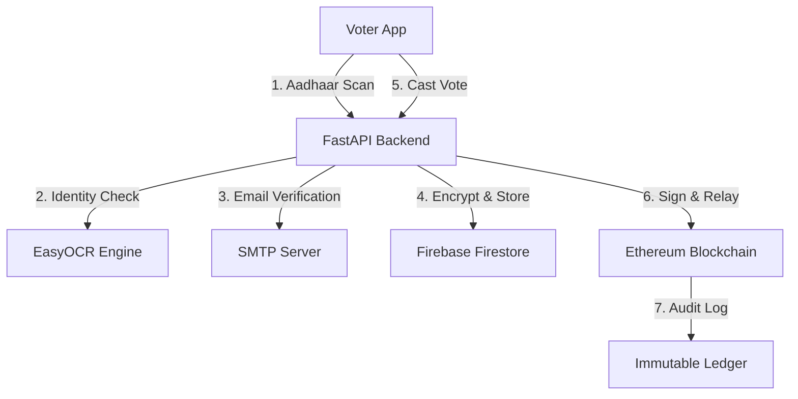

# SecureVote 🛡️ | Decentralized Secure Voting System


**SecureVote** is a futuristic, decentralized, and biometrically-secured voting ecosystem. It bridges the gap between **Web3 Auditability** and **Bank-Grade Identity Privacy** by combining **Blockchain**, **Identity Verification**, and **Multi-Factor Authentication**.

Built with a "Zero-Trust" mindset, SecureVote ensures that every vote is unique, anonymous (on-chain), and completely tamper-proof—all without requiring the average voter to manage a crypto wallet or pay for gas.

---

## 📽️ Project Vision
Most voting systems suffer from two extremes: they are either centralized (prone to fraud) or too complex for the average user (requiring MetaMask/Wallets). **SecureVote** solves this:
1.  **Trustless Transparency**: Every ballot is logged on the Ethereum ledger.
2.  **Verifiable Identity**: Integrated OCR ensures Aadhaar authenticity.
3.  **Privacy by Default**: Sensitive PII is protected with **AES-256 Encryption** at rest.

---

## 🛠️ Tech Stack

| Layer | Technologies |
| :--- | :--- |
| **Frontend** | React (Vite), Tailwind CSS, Lucide Icons, Ethers.js |
| **Backend** | FastAPI (Python), EasyOCR, PyCryptodome (AES-256) |
| **Blockchain** | Ethereum (Hardhat), Solidity, OpenZeppelin |
| **Security** | SMTP Zero-Auth Email, Face Signature Deterrant |
| **Database** | Firebase Firestore (Metadata Storage) |

---

## 🚀 Key Features

### 1. 🛡️ Aadhaar Authentication
Uses a custom OCR pipeline (**EasyOCR** + **PIL**) to:
- Scan physical Aadhaar cards for 12-digit UID and linked mobile strings.
- Compare manual user input against scanned card text (Anti-Forgery).
- Automatically extract the voter's mobile number from the card image.

### 2. ⛓️ Gas-Less Blockchain Relayer
A custom-built relayer service that:
- Collects votes from verified users.
- Signs transactions on the backend using an **HMAC Secp256k1** key.
- Guarantees "One Person, One Vote" via Keccak-256 UID hashing (Zero-Disclosure identifiers).

### 3. 🛡️ Hardened Data Privacy (**AES-256**)
- All sensitive identifiers (Aadhaar, Voter ID) are encrypted with **AES-256 CBC** before being saved to Firebase.
- Decryption happens just-in-time for verification, ensuring no plaintext leaks.

### 4. 🔑 Multi-Channel MFA
To prevent phantom voting, a voter must prove possession of:
- Physical Identity (Aadhaar Scan).
- Access to Communication (Email Verification Code).

---

## 🏗️ System Architecture



---

## ⚙️ Setup & Installation

### Prerequisite
- **Node.js** (v18+)
- **Python** (3.10+)
- **Hardhat Node** (running locally)

### 1. Backend Configuration
```bash
cd backend
python -m venv venv
venv\Scripts\activate
pip install -r requirements.txt
```
Create a `.env` in `backend/` with:
```bash
FIREBASE_SERVICE_ACCOUNT_PATH="firebase-adminsdk.json"
BLOCKCHAIN_RPC_URL="http://127.0.0.1:8545"
ADMIN_PRIVATE_KEY="0x..." # Hardhat account #0
AADHAAR_ENCRYPTION_KEY="32_char_secret_key_here"

# --- EMAIL (SMTP) CONFIG ---
SMTP_USER="your_email@gmail.com"
SMTP_PASSWORD="your_app_password"
SMTP_SERVER="smtp.gmail.com"
SMTP_PORT=587
```

### 2. Frontend Configuration
```bash
cd frontend
npm install
npm run dev
```

### 3. Blockchain Deployment
```bash
npx hardhat node
npx hardhat run scripts/deploy.js --network localhost
```

---

## 📜 Future Roadmap
- [ ] **Zero-Knowledge Proofs (ZKP)**: Prove group membership without revealing identity.
- [ ] **L2 Scaling**: Integrate Polygon/Arbitrum for near-zero transaction costs.
- [ ] **Official UIDAI Integration**: Scale from OCR to official Aadhaar e-KYC.
- [ ] **Merkle Proof Portal**: Allow voters to verify their vote inclusion anonymously.

---

## 🛡️ License & Disclaimer
This project is an **MVP (Minimum Viable Product)** built for educational and research purposes in the field of GovTech. It is not intended for use in live government elections without extensive security audits of the private key management and biometric hardware layers.

---
*Created and Developed by Bhavya Modi,Rudra Kahar,Mansi Jobanputra*
